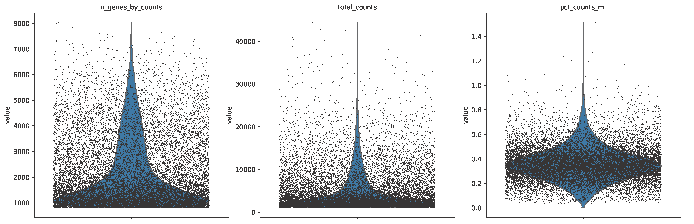

# suda Machine Learning 2025 Fall Final

## 题目

单细胞转录组聚类分析

## 背景

单细胞转录组测序技术能够在单个细胞水平上解析基因表达模式，为理解细胞异质性、发育轨迹及疾病机制提供了前所未有的视角。细胞聚类是单细胞数据分析的核心步骤之一，其目标是将具有相似表达模式的细胞归为同一群体，从而识别潜在的细胞类型或状态。聚类分析不仅有助于发现新的细胞亚群，还能为后续的细胞注释、差异表达分析和功能研究奠定基础。

## 数据集

[Single-cell transcriptomics of 20 mouse organs creates a Tabula Muris](https://www.nature.com/articles/s41586-018-0590-4)

[Evolution of pallium, hippocampus, and cortical cell types revealed by single-cell transcriptomics in reptiles](https://www.science.org/doi/10.1126/science.aar4237)

[百度网盘链接](https://pan.baidu.com/s/1n9cgGDf3gGvZ16pdgnr7ng) 提取码：ruca

## 要求

请基于上述数据集，使用Python编程语言，完成单细胞转录组数据的聚类分析。你需要对数据进行预处理（如低质量数据过滤、高变异基因选择、归一化等），随后设计一种聚类方法对细胞进行分组，并利用已知的细胞类型标签评估聚类效果（评估指标为：NMI、ARI及ACC）。最终需提交一份简要报告，包括方法描述、结果分析与可视化。

## 杂记

### 一些专有名词

* scRNA-seq (Single-Cell RNA Sequencing): 单细胞RNA测序
* QC (Quality Control): 质量控制
* UMI (Unique Molecular Identifiers): 独特分子标识
* mitochondrial: 线粒体，简称MT/mt
* ribosomal: 核糖体，简称ribo
* ribosomal protein S: 核糖体蛋白S基因，简称RPS
* ribosomal protein L: 核糖体蛋白L基因，简称RPL
* violin plots: 小提琴图

### SCANPY

一个基于python的生物数据分析工具库。[论文](https://doi.org/10.1186/s13059-017-1382-0)，[github](https://github.com/scverse/scanpy)

### Annotated Data (anndata, .h5ad文件)

一种用于存储高维矩阵数据及其注释信息的数据结构（[github](https://github.com/scverse/anndata)），常用于存储细胞信息。类定义：
```python
class anndata.AnnData(X=None, obs=None, var=None, uns=None, *, obsm=None, varm=None, layers=None, raw=None, dtype=None, shape=None, filename=None, filemode=None, asview=False, obsp=None, varp=None, oidx=None, vidx=None)
```
细胞数据中的主要属性：
* `X`为主矩阵，是一个稀疏矩阵，形状 $\mathbb{R}^{c\times g}$，其中 $c$ 代表细胞数，$g$ 代表基因数
* `obs`为细胞注释，$c\times n$ 的矩阵，其中 $n$ 为细胞属性个数
* `var`为基因注释，长度为 $g$ 的列表

读取anndata的样例代码：
```python
import scanpy as sc
import numpy as np

raw_data = sc.read("../data/Tosches_turtle.h5ad", index_col=0)

# 将空值转换为0
processed_data = np.nan_to_num(raw_data.X, nan=0.0)
raw_data.X = processed_data
label = raw_data.obs['celltype']
```

### scRNA-seq的实验流程

scRNA-seq 的流程可以理解为：

1. 从某一组织中获取细胞悬液，*理想情况下*溶液中是完全分离的单个细胞。

2. 通过微流控系统生成大量液滴，*理想情况下*，每个液滴中包含：

    * 一个细胞

    * 一颗带有唯一 cell barcode 的 bead

3. 在液滴中细胞被裂解，释放出的 mRNA 被 bead 上的引物捕获。
每条引物携带：

    * 固定的 cell barcode（标记细胞）

    * 随机的 UMI（标记分子）

4. 因此，每条 mRNA 在反转录前已经被唯一标记为
(cell barcode, UMI, gene)。

5. mRNA 被反转录成 cDNA，并通过 PCR 扩增产生大量拷贝，但这些拷贝保留相同的 barcode 和 UMI。

6. 对所有 cDNA 进行高通量测序，根据测序结果：

    * 按 cell barcode 区分细胞

    * 按基因比对

    * 按 UMI 去重

7. 最终得到一个表达矩阵，其中每个数值表示：
某个细胞中某个基因被捕获到的原始 mRNA 分子数（UMI 数）。

### 单细胞数据预处理流程

单细胞聚类前典型流程：

1. 原始数据 → 表达矩阵

2. 细胞 QC

3. 基因 QC

4. 归一化（LogNormalize / SCTransform）

5. 高变基因筛选

6. Scaling + 回归变量

7. PCA

8. Doublet 去除

9. 批次校正（如需要）

👉 再进入：邻接图构建、聚类、UMAP/tSNE

可参考 [scanpy-clustering](https://scanpy.readthedocs.io/en/stable/tutorials/basics/clustering.html)。

### 高变基因

在不同细胞中表达量具有显著差异的基因。通常采用基因表达水平的变异系数（coefficient of variation）来判断高变基因。

记 $y_i\in \mathbb{R}^m$ 是由基因 $i$ 在各个细胞中表达值构成的 $m$ 维向量，则基因 $i$ 的变异系数 $cv_i$ 为：
$$
cv_i = \frac{\text{std}(y_i)}{\text{mean}(y_i)}
$$

可调用 scanpy 中的 `pp.highly_variable_genes` 筛选出高变基因，例如 `sc.pp.highly_variable_genes(adata, n_top_genes=2000)`。

### 细胞聚类评价指标

#### NMI (归一化互信息)

衡量聚类结果与真是标签之间的信息一致性。

给定真实细胞划分 $U$，对于聚类结果 $V$，其互信息为
$$
MI(U, V) = \sum_{u\in U}\sum_{v\in V}p(u, v)\log\frac{p(u, v)}{p(u), p(v)}
$$

归一化
$$
NMI(U, V) = \frac{2\cdot MI(U, V)}{H(U)+H(V)}
$$
其中 $H(\cdot)$ 为信息熵。

可调用sickit-learn中的`sklearn.metrics.normalized_mutual_info_score(labels_true, labels_pred, average_method)`计算（见 [doc](https://scikit-learn.org/stable/modules/generated/sklearn.metrics.normalized_mutual_info_score.html)）

#### ARI (调整兰德指数)

衡量细胞对层面上的聚类一致性。

$$
ARI = \frac{RI - E(RI)}{\max(RI) - E(RI)}
$$
其中 $RI$ 为兰德指数，$E(\cdot)$ 表示期望。

可调用sickit-learn中的`sklearn.metrics.adjusted_rand_score(labels_true, labels_pred)`计算（见 [doc](https://scikit-learn.org/stable/modules/generated/sklearn.metrics.adjusted_rand_score.html)）

#### ACC (聚类准确率)

衡量聚类标签与真实标签在最佳匹配下的一致比例。

由于聚类后的类标签是无意义的，因此需要将聚类后的类标签映射到真实标签再进行计算。给定真实标签 $U$，对于聚类结果 $V$，定义准确率
$$
ACC = \frac{1}{N}\sum_{i=1}^N \mathbf{1}\{u_i=\text{map}(v_i)\}
$$
其中 $\text{map}(\cdot)$ 为将聚类簇映射到真实细胞类型的最佳映射函数，通常可基于匈牙利算法得到。

### 传统细胞聚类方法

PCA降维（特征提取）+ KNN建图 + Leiden算法进行图聚类。参考 [doc1](https://www.sc-best-practices.org/cellular_structure/clustering.html?utm_source=chatgpt.com#) [scanpy-clustering](https://scanpy.readthedocs.io/en/stable/tutorials/basics/clustering.html)。

### scvi-tools

一个基于深度学习的单细胞分析库。[github](https://github.com/scverse/scvi-tools.git) [paper](https://www.nature.com/articles/s41592-018-0229-2)

### 小提琴图 (violin plots)



纵坐标代表具体数值，横向宽度代表某一值的个体数量。黑色点代表一个个体。可用于观测某一个体在某个值上的分布。相对于条形图，小提琴图不仅展示统计量，还展示数据分布本身。

n_genes_by_counts 图：每个细胞检测到的基因数。

total_counts 图：每个细胞的UMI数。

pct_counts_mt 图：线粒体基因占比。
